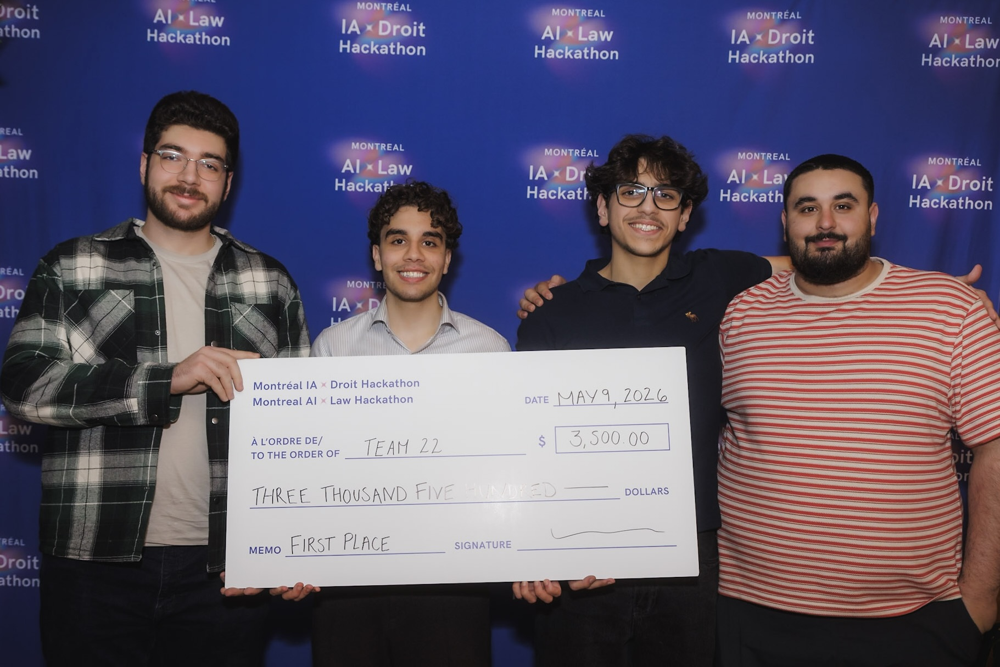

# JusticeLine

> First place - Montreal AI x Law Hackathon (May 9)
>
> LinkedIn post: https://www.linkedin.com/posts/montreal-ai-x-law-hackathon_le-9-mai-dernier-nous-%C3%A9tions-ravies-d-activity-7460446147787128832-0bwn
>
> 

Short prototype built during the Montreal AI x Law hackathon. This repository contains a Python-based prototype that ties together an "open justice" data helper, an SMS/webhook interface, and a small web service used during the competition. The project won 1st place at the hackathon.

Key files
- `main.py` - application entrypoint (starts the web service)
- `openjustice.py` - helper(s) for interacting with open justice / legal data
- `sms.py` - SMS integration helpers (e.g., Twilio webhook handlers)
- `config.py` - configuration values and environment keys
- `tests/` - unit tests (see `tests/test_session.py` and `tests/test_webhook.py`)
- `requirements.txt` — Python dependencies
- `Dockerfile` - Docker container definition

Requirements
- Python 3.8+ (use a virtual environment)
- Dependencies listed in `requirements.txt`

Quick start (local)
1. Create and activate a virtualenv:

```bash
python -m venv .venv
source .venv/bin/activate
```

2. Install dependencies:

```bash
pip install -r requirements.txt
```

3. Run the service (development):

```bash
python main.py
```

Docker

Build the image:

```bash
docker build -t justiceline .
```

Run the container (example):

```bash
docker run -p 8000:8000 justiceline
```

Tests

Run the test suite with `pytest`:

```bash
pytest -q
```

